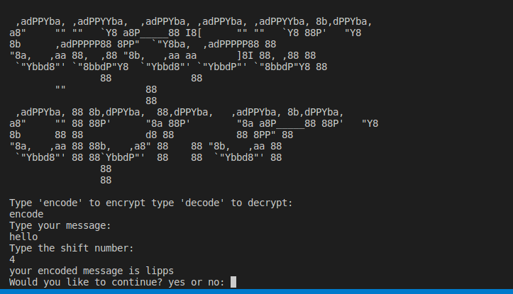

# Day2

## Lessons learned today

- functions with inputs
```
def caser(text,shift):
    ...
```
- Arguments and parameters
```
def caser(text,shift)
    ...
caser("hello",5)
```
- Position and keyword arguments
```
caser("hello",4)

caser(text="hello",shift=5)
```

## Project to solidify material learned 

### Caeser_cipher:
> Caesar cipher is an encryption technique. It is a type of substitution cipher in which each letter in the plaintext is replaced by a letter some fixed number of positions down the alphabet. For example, with a left shift of 3, D would be replaced by A, E would become B, and so on.

#### Preview:




## How to run this on your device

- Clone this repository
```
git clone https://github.com/kingdreamerr/Day8_Caser_cipher.git
```
- cd into the repo
```
cd Day8_Caser_cipher
```

- Paste the following in the terminal 
```
python3 main.py
```